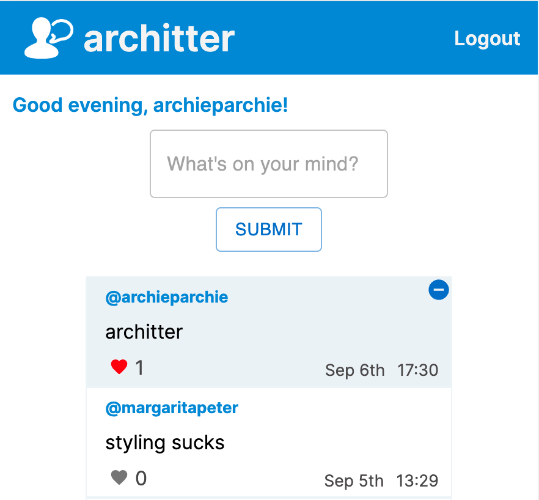

# architter

[A Twitter clone built in React.](https://architter-app.herokuapp.com/)

A solo front-end project using an API set up by Makers Academy, information on the routes can be found [here](https://github.com/makersacademy/chitter_api_backend#readme). This was a good exercise in my developing cleaner UI using the React library, with the help of Material UI.

The API allows for a user to sign up, log in (returning a session key), post "Peeps", delete peeps, and like their's or other user's peeps. (other users being fellow Makers Students). See below, or check it out for yourself following the link above.

